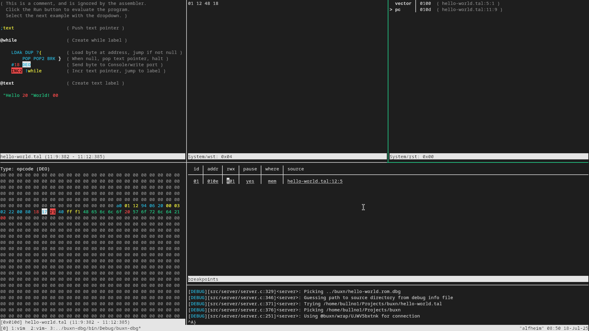

# buxn-dbg

A TUI step debugger for [uxntal](https://wiki.xxiivv.com/site/uxntal.html).



## Building

Required software:

* clang
* mold
* cmake
* ninja

```sh
./bootstrap  # To update dependencies
BUILD_TYPE=RelWithDebInfo ./build
```

During development, `./watch` will watch the directory and build whenever a change is detected.

## How to use
### Overview

The debugger is based on the concept of a multiplexer.
It is designed to be used with a terminal multiplexer such as tmux.

First, the debug server communicates with the uxn virtual machine using the [debug protocol](https://github.com/bullno1/buxn/blob/master/doc/dbg.md).
It tracks the state of the VM persistently.
However, it does not do any rendering or interaction with the user.

Then, there are many different view programs.
Each will connect to the debug server, query the state and render different aspects: source code, breakpoint, memory, stack...
They also handle

For ease of distribution, all programs are packaged into a single executable: `buxn-dbg`.
Each one is exposed as a different subcommand.

To view the list of subcommand, use: `buxn-dbg --help`.
To view how to use each subcommand, use: `buxn-dbg <command> --help`.
For example: `buxn-dbg view:source --help`.
All commands have defaults to help with the most common case: running a single instance of the debugger.
CLI arguments are usually not necessary.

#### Control

All views have a consistent control scheme:

* Arrow keys: Move the focus in the given direction
* Vim keys (hjkl): Same as above
* Esc/Ctrl+C: Quit
* 0/Home: Move to start of line
* $/End: Move to end of line

The source and memory views also have the following control:

* s: (S)tep in 
* n: (N)ext or step over
* r: (R)eturn or step out
* c: (C)ontinue
* b: (B)reakpoint toggle
* Enter: When hovering over a label reference, follow the reference

The key bindings are inspired by the [python debugger](https://docs.python.org/3/library/pdb.html).

The "focus" of all views are synchronized.
For example: Hovering on a byte in the memory view will also make the corresponding opcode in the source view highlighted.

#### Status line

Most view also has a status line at the bottom.

For some views like source and memory, when the status line is red, it means the program is being executed or the VM is busy/not responding.
You can still use the view but actions such as toggling breakpoint or stepping might not be immediately responsive.

### server

This is the most important component.

`--dbg-file` and `--src-dir` can be use to specify the path to the debug symbol and source file.
The debugger can work without them but its functionality is limited.
However, a more convenient usage is "wrapper mode":

```sh
buxn-dbg server buxn-cli ../buxn/hello-world.rom
```

The server will:

* Execute the command given to it as a subprocess
* Try to attach to the VM in the subprocess
* Guess the path to the debug symbol and source file

The guessing is based on command line argument.
First, to find the debug symbol file:

* It scan the arguments for anything that ends with `.rom` and attempt to append `.dbg` to it.
* If a file is found, this is the debug symbol.

Then, to find the source:

1. Read the debug symbol file and locate the first source file mentioned.
2. From the same directory as the rom file, try to find whether the source file is found.
3. If it is, this is chosen as the source directory.
   All subsequent source files are considered to be within this directory.
   This is because source files are stored as relative path in the debug symbol file.
4. If it is not found, back up one level to the parent directory and try step 2 again until we reach root.

This sounds sloppy but in practice, it works surprisingly well.
When it doesn't, you can still explicitly set the paths to stop it from guessing.

### view:source

This is the source view.
It is only available if debug symbol is provided.
It has semantic highlighting to make browsing easier.

Breakpoints will be highlighted in red.

### view:wst

This shows the content of the working stack.

### view:rst

This shows the content of the return stack.
The source location is annotated if debug symbol is available.
It will also shows the address of the current vector as the first entry in the list as well as the current pc (program counter).

Navigating through the list will also update the source and the memory view to point at the corresponding location.

If the program uses the return stack for arbitrary data, some of the locations might be bogus.

### view:breakpoints

This lists all the breakpoints in the program.

Breakpoints are shown in a table.
Different breakpoint attributes can be toggled with the `b` key.
To know more about breakpoint attributes, refer to [this document](https://github.com/bullno1/buxn/blob/master/doc/dbg.md#the-debugger-core-buxn-dbg-core).

Navigating through the list will also update the source and memory view.

### view:memory

This shows the program memory.

Different bytes are highlighted based on what kind of elements it corresponds to (opcode, number, text...).
Breakpoint locations are also highlighted in red.
